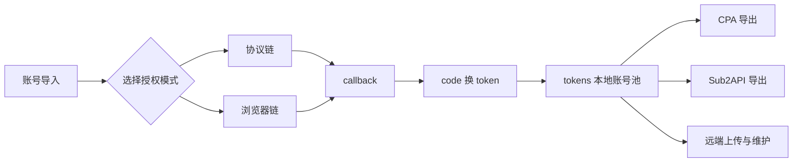

<div align="center">
  

  # OpenAI Token Manager

  <p>一个面向多账号运维场景的 OpenAI Token 管理工具</p>

  <p>
    
    
    
    
  </p>

  <p>
    <a href="说明文档.md"><strong>详细说明文档</strong></a>
    ·
    <a href="#快速上手"><strong>快速上手</strong></a>
    ·
    <a href="#核心能力"><strong>核心能力</strong></a>
    ·
    <a href="#工具链"><strong>工具链</strong></a>
  </p>
</div>

---

> 这不是单纯的 token 存储器。
>
> 它把本地账号池、批量刷新、手动授权、2FA 批量授权、CPA 远端管理、Sub2API 远端管理、格式互转、导出整理和日志追踪放到了一套 GUI 里。

## 预览

<table>
  <tr>
    <td width="50%">
      <h3>本地账号池</h3>
      <p>统一看本地 tokens，做刷新、同步标签、删除、导出和上传。</p>
    </td>
    <td width="50%">
      <h3>双授权链</h3>
      <p>协议链适合快刷，浏览器链适合补真实页面环境，两条都能留着一起用。</p>
    </td>
  </tr>
  <tr>
    <td width="50%">
      <h3>远端管理</h3>
      <p>CPA 和 Sub2API 都有单独管理页，支持筛选、刷新、删除、封禁或失效整理。</p>
    </td>
    <td width="50%">
      <h3>链路调试</h3>
      <p>内置 Flow Probe 相关工具，适合抓真实浏览器请求链，复盘授权流程。</p>
    </td>
  </tr>
</table>

## 核心能力

| 模块 | 说明 |
| --- | --- |
| 本地账号池 | 统一管理 `tokens`，支持批量刷新、标签同步、筛选、删除 |
| 手动授权 | 生成 OAuth 链接，手动登录后提交 callback 保存 |
| 浏览器辅助授权 | 本地监听回调，自动打开浏览器，适合单账号半自动流程 |
| 2FA 协议链 | 纯协议批量授权，速度快，适合大量账号并发 |
| 2FA 浏览器链 | 真实浏览器批量授权，更贴近真实页面环境 |
| CPA 管理 | 远端账号池管理、批量刷新、封禁记录整理、导回本地 |
| Sub2API 管理 | 远端账号池管理、状态筛选、失效记录清理 |
| 转换与导出 | CPA 单账号导出，Sub2API 聚合导出，支持文件和剪贴板回导 |
| 链路监听 | Flow Probe Studio 和登录监听脚本，用来抓真实请求链 |

## 双授权链



### 协议链

适合快刷和高并发批量补授权。

它直接走协议请求，默认通过 `2fa.live` 获取 TOTP，再走 OAuth 回调换 token。

### 浏览器链

适合协议链不稳、需要更完整页面环境时使用。

它会启动真实 Chrome 或 Edge 窗口，一条线程对应一个独立浏览器实例，带独立 profile、独立调试端口和独立会话态。

## 数据目录

| 路径 | 用途 |
| --- | --- |
| `tokens/` | 本地真实账号池主数据 |
| `outputs/CPA/` | CPA 格式单账号导出 |
| `outputs/Sub2API/` | Sub2API 导出，整理后是聚合文件 |
| `outputs/auth_2fa_live/` | 协议链批量授权报告 |
| `outputs/auth_2fa_browser/` | 浏览器链批量授权报告和浏览器 profile |
| `outputs/auth_probe/` | 单账号 OAuth 测试结果 |
| `outputs/FlowProbeStudio/` | Flow Probe Studio 抓包和监听产物 |

## 快速上手

### 1. 安装依赖

```bash
pip install -r requirements.txt
pip install pyinstaller
```

### 2. 源码启动

```bash
python main.py gui
```

### 3. 打包启动

直接运行：

```text
dist/OpenAI-Token-Manager.exe
```

### 4. 打包主程序

```bash
python build.py --name OpenAI-Token-Manager --entry-point main.py
```

如果想重建产物：

```bash
python build.py --clean --name OpenAI-Token-Manager --entry-point main.py
```

## 典型使用路径

### 本地维护

导入账号到本地 `tokens`，然后做刷新、同步标签、筛选和导出。

### 协议链批量补授权

在 `2FA授权` 页选择 `协议链`，导入 `邮箱----密码----2FA密匙`，设置线程数后直接跑。

### 浏览器链批量补授权

在 `2FA授权` 页选择 `浏览器链`，确认浏览器路径和起始端口，再按线程数批量启动独立浏览器授权。

### 远端池维护

先刷新 CPA 或 Sub2API 远端列表，再筛选、刷新、删除、整理封禁或失效记录，必要时导回本地。

## 工具链

| 工具 | 作用 |
| --- | --- |
| `tools/auth_probe.py` | 测试 OAuth 起点、浏览器回调和换 token |
| `tools/auth_2fa_live.py` | 协议链 2FA 授权脚本 |
| `tools/auth_2fa_browser.py` | 浏览器链 2FA 授权脚本 |
| `tools/flow_probe_app.py` | 图形化浏览器请求链监听工具 |
| `tools/live_login_flow_probe.py` | 更底层的登录流程监听脚本 |

## 常见问题

<details>
  <summary><strong>Flow Probe Studio 点开始监听时报 127.0.0.1:9222 connection refused</strong></summary>
  <br>
  这不是链路坏了，是本地没有调试浏览器在监听对应端口。先点工具里的启动调试浏览器，或者自己带上 <code>--remote-debugging-port=9222 --remote-allow-origins=*</code> 去启动 Chrome 或 Edge。
</details>

<details>
  <summary><strong>Sub2API 提示 Invalid admin API key</strong></summary>
  <br>
  这是远端鉴权失败，通常是管理 Token 或 API Key 填错了，不是普通账号密码问题。
</details>

<details>
  <summary><strong>浏览器链日志里出现 egress_drift</strong></summary>
  <br>
  说明同一条授权会话前后出口 IP 变了。常见于同入口代理自动轮询不同出口，这会增加风控风险。
</details>

<details>
  <summary><strong>看到 token invalidated 或 Your authentication token has been invalidated</strong></summary>
  <br>
  这类账号会被 CPA 和 Sub2API 的失效模块单独归类，方便集中删除。
</details>

## 文档

完整使用说明、目录逻辑、远端管理、工具链、打包和常见报错，统一写在这里：

➡️ [说明文档.md](说明文档.md)
